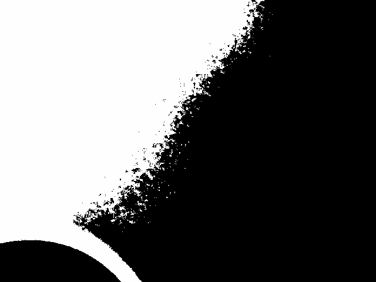
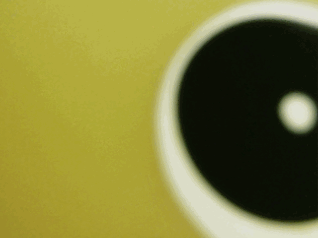
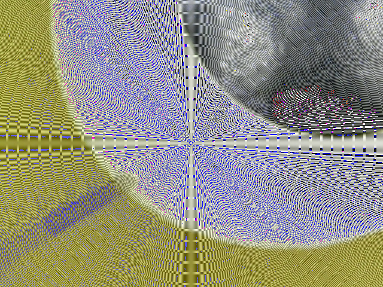

# Microscope Application

## Overview

This project provides a Java-based application to operate and analyse the camera views from an IZOXIS USB microscope. The application supports various camera view modes, including binary, mirrored, negative, and noised.

## Features

  - Real-time Display: <br>
  Provides real-time processing and display of the camera feed. This feature ensures that all changes to the view modes are instantly reflected in the display, allowing for immediate analysis and adjustments.

  - User Interface: <br>
  Simple and intuitive UI with 2 camera views and 1 menu window, supported up to 3 screens. The user interface is designed to be user-friendly, enabling easy switching between view modes and adjustment of parameters without requiring extensive technical knowledge.

  - Save images: <br>
  Provides save of the current image frame to any location on the device. The image can be saved as a png file or short animation in gif format.

  - Binary View: <br>
  Converts the camera feed to a binary (black and white) image. This view is particularly useful for analysing high-contrast images and distinguishing objects from the background.
  

  - Mirrored View: <br>
  Displays the camera feed as a mirrored image. This view is helpful when you need to observe the sample from a flipped perspective, making it easier to compare the sample's symmetry or view it from an alternative angle.
  

  - Negative View: <br>
  Inverts the colours of the camera feed to create a negative image. This view mode is beneficial for highlighting specific features that may be less visible in the normal view. The negative view can enhance contrast and reveal details that are otherwise hard to notice, making it easier to analyse the sample.
  

  - Noised View: <br>
  Applies a noise filter to the camera feed. This view adds hypnosis noise consisting of evenly spaced circles to the image.
  

## Installation
- Clone the repository: <br>
```
git clone https://github.com/PPowroznik02/Microscope-Aplication.git
cd Microscope-Aplication
```

- Install dependencies: <br>
Ensure JavaFX is properly set up in your environment. You can download JavaFX from [GluonHQ](https://gluonhq.com/products/javafx/).

- Build the project: <br>
You can use your preferred IDE (such as IntelliJ IDEA or Eclipse) to build the project, or use the command line with Maven or Gradle.

## Run application
- Open terminal and navigate to your project directory.
- Add executable permissions to [s](Camera/s) binary .file.
```bash
chmod u+x s
```
- Run the [s](Camera/s) executable file.
```bash
./s
```
- If necessary, compile application.
```bash
comp_FX javaFXApp.java
```
- Run application.
```bash
run_FX JavaFXpp
```